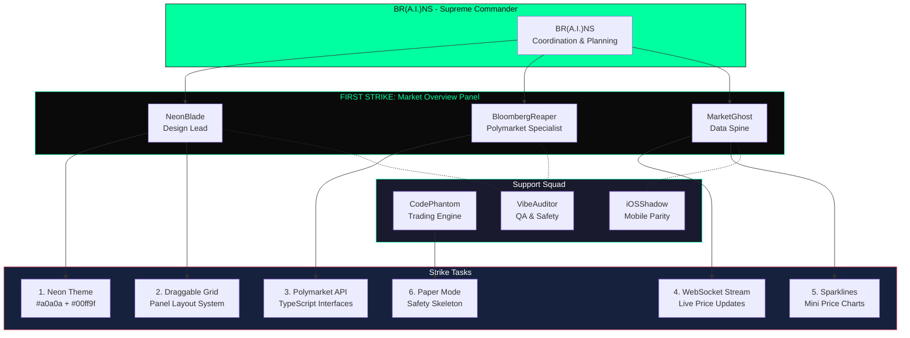

# FIRST STRIKE PLAN — MARKET OVERVIEW PANEL

**Squad Lead:** NeonBlade + BloombergReaper + MarketGhost
**Branch:** feature/strike-1-market-overview
**Timeline:** 24 hours
**Status:** ACTIVE

## MERMAID SQUAD DEPLOYMENT DIAGRAM

## 5-STEP LIGHTNING STRIKE

### STEP 1: NEON THEME (NeonBlade)
- [ ] Terminal loads with dark void theme (#0a0a0a)
- [ ] Neon green (#00ff9f) accents on all active elements
- [ ] No white flash or FOUC on load
- [ ] Consistent design tokens established

### STEP 2: DRAGGABLE GRID (NeonBlade)
- [ ] Panel drag/resize system at 60fps
- [ ] Save/restore layouts in less than 2 clicks
- [ ] Touch gestures work on mobile
- [ ] Keyboard navigation support

### STEP 3: POLYMARKET API (BloombergReaper)
- [ ] CLOBClient TypeScript interfaces
- [ ] Market data normalization layer
- [ ] Rate limiting (10 req/s)
- [ ] Error handling and fallbacks

### STEP 4: LIVE UPDATES (MarketGhost)
- [ ] WebSocket stream connected
- [ ] Prices update within 100ms of on-chain event
- [ ] Sparkline mini-charts (last 30 ticks)
- [ ] Graceful degradation on WS failure

### STEP 5: PAPER MODE (CodePhantom + VibeAuditor)
- [ ] Paper trading indicator in status bar
- [ ] Dry-run mode default enforced
- [ ] Kill switch (Cmd+K) wired
- [ ] E2E test scaffolding complete

## SUCCESS CRITERIA
- Panel can be dragged to any grid position
- Prices update within 100ms of on-chain event
- No white flash or FOUC on load
- Touch gestures work on mobile
- All smoke tests pass
- PR opened with video demo (max 3 min)

## KEYBOARD SHORTCUTS
| Key | Action |
|-----|--------|
| Cmd+K | Kill switch toggle |
| Cmd+G | Toggle grid mode |
| Cmd+1 | Focus Market Overview |
| Cmd+2 | Focus Signals Sidebar |
| Cmd+R | Refresh data |
| Esc | Close panel detail view |

---

**Status:** ACTIVE - STRIKE 1 IN PROGRESS
**Next:** PR review after all steps complete